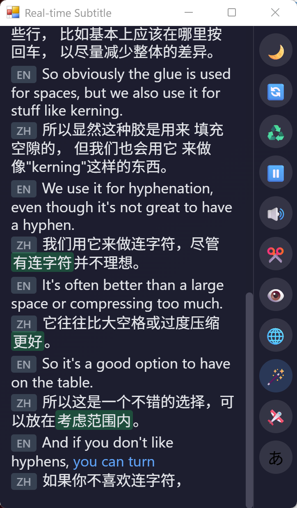

# Realtime Subtitle

A real-time speech-to-subtitle tool based on Soniox API. Captures system audio and displays live transcription and translation.

**Requires your own Soniox API Key** which costs money based on usage. See [Soniox Pricing](https://soniox.com/pricing) for details.

~~Soniox used to offer free credits.~~ Sadly they no longer do so anymore.

<div align="center">
    
</div>

## Features

- Speech recognition powered by Soniox
- Real-time translation (uses system language as target by default)
- LLM translation enhancement with 3 modes:
  - **Off**: No LLM enhancement
  - **Refine**: Use LLM to improve Soniox translations
  - **LLM-only**: Disable Soniox translation and use LLM for direct translation
- And more (I'm too lazy to list them all; just hover over the buttons and check the tooltips)

## Installation

Download the latest release from the Releases page, or install from source:
```bash
git clone https://github.com/febilly/realtime-subtitle
cd RealtimeSubtitle
pip install -r requirements.txt
```

## Configuration

Choose one of the following methods to provide your Soniox API key.

- Set the `SONIOX_API_KEY` environment variable to your API key
- Set the `SONIOX_TEMP_KEY_URL` environment variable to point to a temporary key endpoint

This program will also try to read the environment variables from a `.env` file if it exists, like this:

```env
SONIOX_API_KEY="your-key-goes-in-here"
```

### Optional: LLM translation enhancement

You can optionally enable LLM translation enhancement. The UI toggle is only shown when the required LLM settings are present.

**Three modes available:**
- **Off** (default): No LLM enhancement
- **Refine**: LLM improves Soniox translations (click the 🪄 magic wand button once)
- **LLM-only**: Disable Soniox translation, use LLM for direct translation (click twice to see 🤖 robot icon)

Note: In LLM-only mode, the "translation" segment mode is automatically disabled and falls back to "punctuation" mode.

You can get some free quota from [Cerebras(recommended)](https://cerebras.net/) or [OpenRouter](https://openrouter.ai/).

Configure an OpenAI-compatible endpoint via:

```env
# Example configuration
LLM_BASE_URL="https://api.cerebras.ai/v1"
LLM_MODEL="qwen-3-32b"
LLM_API_KEY="<your-key-goes-here>"
LLM_PROMPT_SUFFIX="/no_think"
LLM_TEMPERATURE="0.6"
```

## Run

```bash
python server.py
```

Add `--debug` flag to enable debug mode.

## Tip
- Since the interface is just a webpage, you can use `ctrl/cmd + mousewheel` (or `ctrl/cmd + plus/minus` if you prefer) to zoom in/out the text size.

## Build

```bash
pip install pyinstaller
python build_exe.py
```

The executable will be located at `dist/RealtimeSubtitle.exe`.

## Configuration Options

Please run `python server.py --help` to see all the avaliable options.
