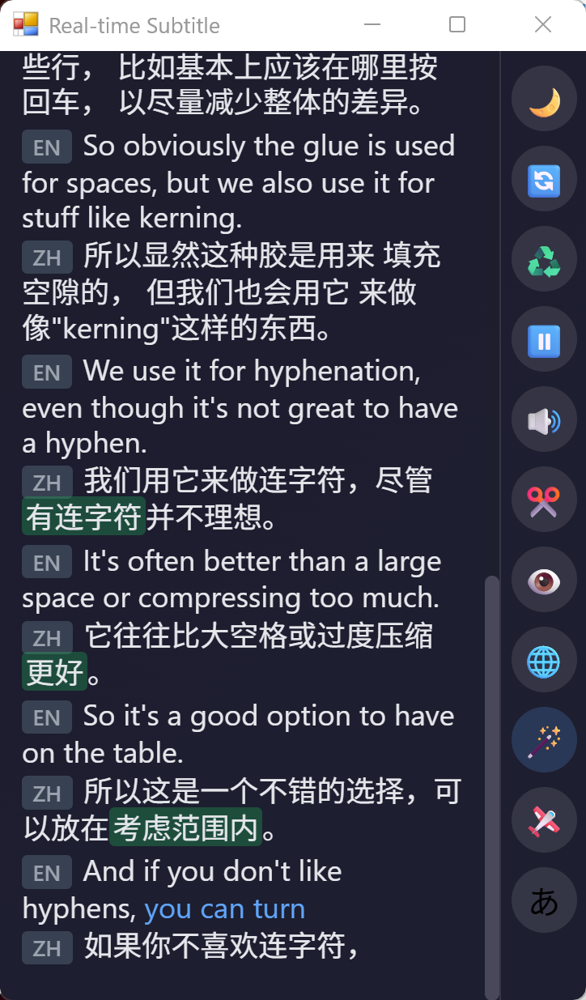

# Realtime Subtitle

A real-time speech-to-subtitle tool. Captures system audio and displays live transcription and translation.

Supports two translation providers; you pick one at startup:

- **Soniox** — real-time STT + translation (supports speaker diarization and segmentation modes).
- **Gemini** — Gemini Live Translation (more target languages, no diarization/segmentation).

**Requires your own API key** for the provider you choose; both cost money based on usage. See [Soniox Pricing](https://soniox.com/pricing) or [Gemini API pricing](https://ai.google.dev/pricing) for details.

<div align="center">
    
</div>

## Features

- Speech recognition and translation powered by Soniox or Gemini (switchable at runtime)
- Real-time translation (uses system language as target by default)
- Use LLM to refine completed translations (optional)
- And more (I'm too lazy to list them all; just hover over the buttons and check the tooltips)

## Installation

Download the latest release from the Releases page, or install from source:
```bash
git clone https://github.com/febilly/realtime-subtitle
cd RealtimeSubtitle
pip install -r requirements.txt
```

## Configuration

The easiest way to configure the provider and API key is the in-app **Settings panel** (the ⚙️ gear button). Anything you set there is saved in your browser (`localStorage`) and applied instantly at runtime — no restart and no editing of `.env` required. Environment variables / `.env` act only as a read-only fallback when the Settings panel has nothing stored.

### Choosing a provider

In Settings you can switch between **Soniox** and **Gemini** at any time; the change is hot-applied to the next stream. You can also pre-select a provider before launch (env/`.env` or `--provider soniox|gemini`):

```env
TRANSLATION_PROVIDER="soniox"   # or "gemini"
```

If `TRANSLATION_PROVIDER` is not set, the app uses whichever provider already has a key in the environment, falling back to `soniox`.

### API keys

Enter your key in the Settings panel for the provider you use. Get a key from [Soniox](https://console.soniox.com/) or [Google AI Studio](https://aistudio.google.com/apikey).

Alternatively, set it as an environment variable (read from a `.env` file if present):

```env
# Soniox
SONIOX_API_KEY="<your-key-goes-in-here>"

# Gemini
GEMINI_API_KEY="<your-key-goes-in-here>"
```

### Soniox region

For Soniox you can pick the websocket **API region** — United States (default), European Union, or Japan — from the Settings panel. The choice is validated against the regional endpoint, saved in your browser, and hot-applied to the next stream.

> See [`.env.example`](.env.example) for the full list of environment variables with their defaults.

<details>
<summary>Optional configuration</summary>

### Hide speaker labels in UI

If speaker labels are too noisy/inaccurate for your use case, you can hide them in the UI:

```env
HIDE_SPEAKER_LABELS="True"
```

This only hides the speaker tags in frontend display. Backend speaker diarization can still stay enabled, so transcripts from different speakers are less likely to be merged into the same sentence.

### Silence sleep

To reduce provider usage during long silent periods, enable local silence sleep:

```env
SLEEP_ON_SILENCE="True"
SLEEP_IDLE_SECONDS="30"
SLEEP_PRE_ROLL_SECONDS="1.0"
SLEEP_SPEECH_WINDOW_SECONDS="0.75"
SLEEP_SPEECH_GRACE_SECONDS="0.5"
SLEEP_VAD_THRESHOLD="0.2"
```

When enabled, the app closes the active provider stream after the configured idle time, keeps listening locally, then reopens it when enough speech is detected in the recent confirmation window and flushes the local pre-roll buffer. The `SLEEP_*` tuning applies to both Soniox and Gemini; old provider-specific names are still accepted for compatibility.

### LLM translation refinement

You can optionally enable an "auto-refine completed translations" feature. The UI toggle is only shown when the required LLM settings are present.

The same toggle also provides a **Pure LLM Translation** mode, which skips Soniox translations in the UI and lets the LLM translate directly. You can cycle between Off / Refine / Pure LLM Translation on the wand button.

You can get some free quota from [Cerebras(recommended)](https://cerebras.net/) or [OpenRouter](https://openrouter.ai/).

Configure an OpenAI-compatible endpoint via:

```env
# Example configuration
LLM_BASE_URL="https://api.cerebras.ai/v1"
LLM_MODEL="gpt-oss-120b"
LLM_API_KEY="<your-key-goes-in-here>"
LLM_TEMPERATURE="0.6"

# Dynamic context window for LLM refine/translate (optional)
# Request context size cycles as: MIN -> ... -> MAX -> MIN -> ...
LLM_REFINE_CONTEXT_MIN_COUNT="5"
LLM_REFINE_CONTEXT_MAX_COUNT="10"
```

The dynamic context window above is mainly recommended when your LLM provider offers a prefix-caching discount (which is NOT the case for Cerebras). Otherwise, increasing context size may only increase token cost/latency.

### Transcript logging

Transcript logging is **off by default**. To write transcripts to the `logs/` folder, enable:

```env
ENABLE_TRANSCRIPT_LOG="True"
```

### Extras

Please check `config.py` (or [`.env.example`](.env.example)) for more configuration options.

</details>

## Run

```bash
python server.py
```

Add `--debug` flag to enable debug mode.

## Tip
- Since the interface is just a webpage, you can use `ctrl/cmd + mousewheel` (or `ctrl/cmd + plus/minus` if you prefer) to zoom in/out the text size.

## Build

```bash
pip install pyinstaller
python build_exe.py
```

The executable will be located at `dist/RealtimeSubtitle.exe`.

## Acknowledgements

This project uses [kuromoji.js](https://github.com/takuyaa/kuromoji.js) for Japanese tokenization in the browser.
kuromoji.js is licensed under the [Apache License 2.0](https://www.apache.org/licenses/LICENSE-2.0).

This project uses [vrchat_oscquery](https://github.com/theepicsnail/vrchat_oscquery) for VRChat OSCQuery integration.

## Configuration Options

Please run `python server.py --help` to see all the avaliable options.
